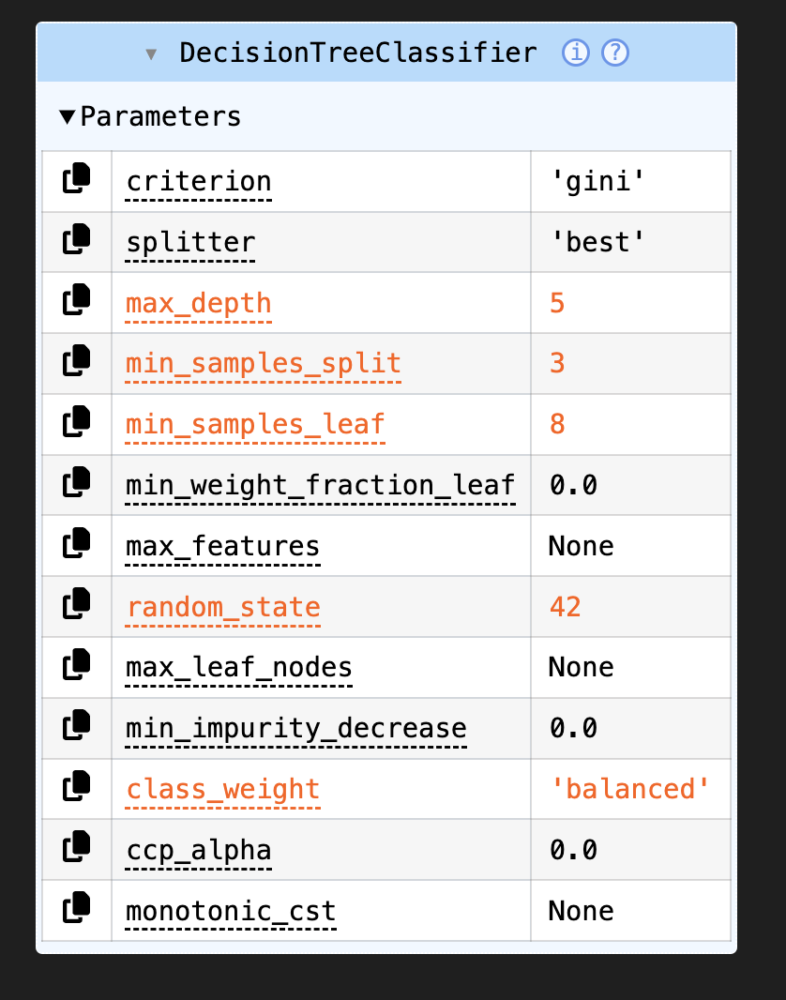
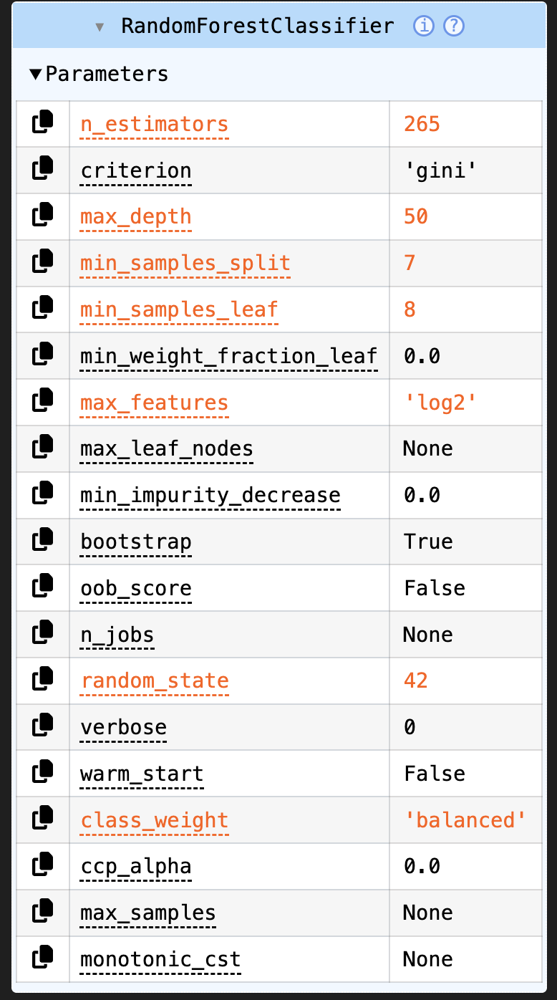
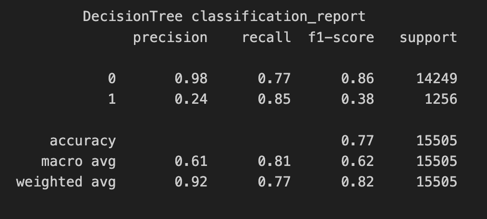
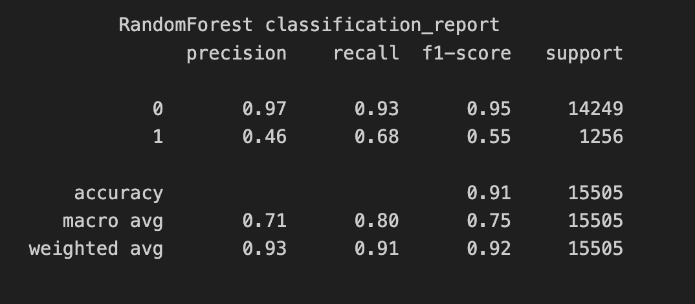
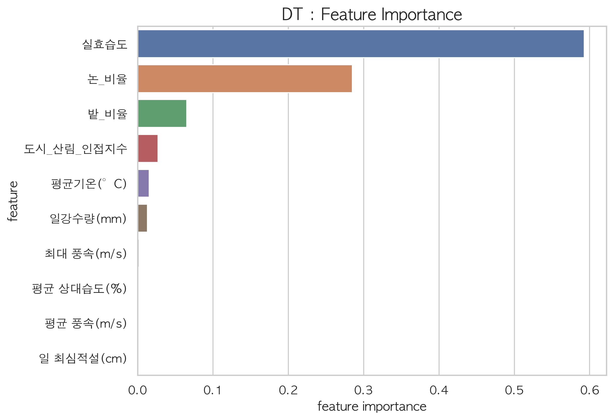
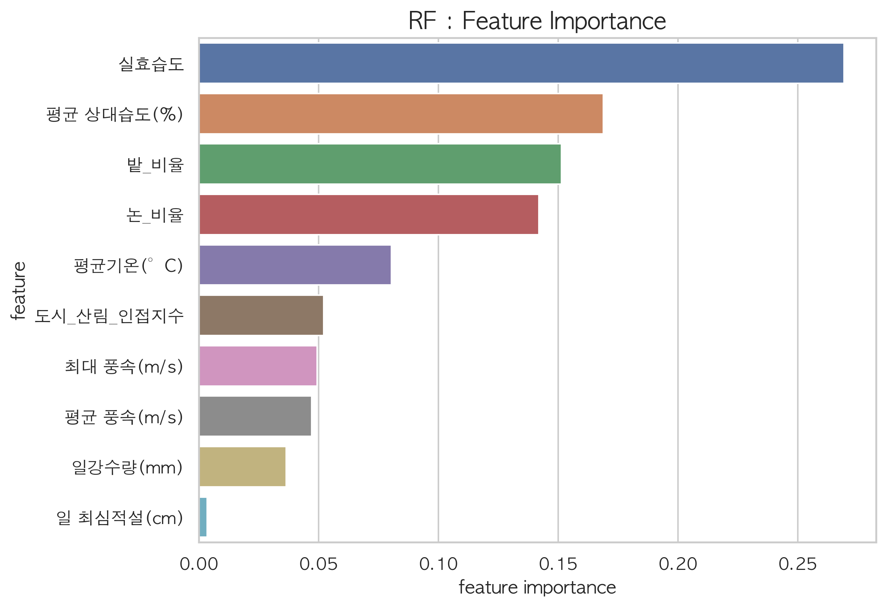
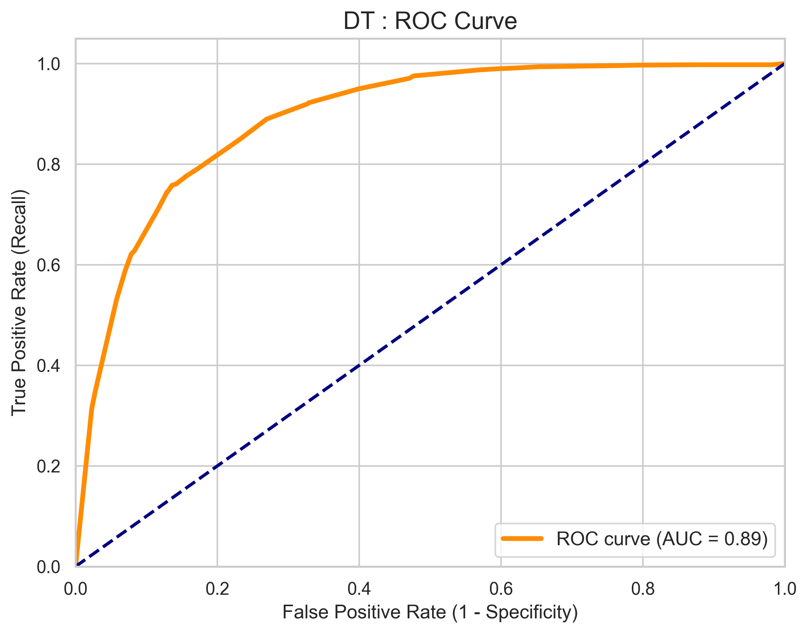
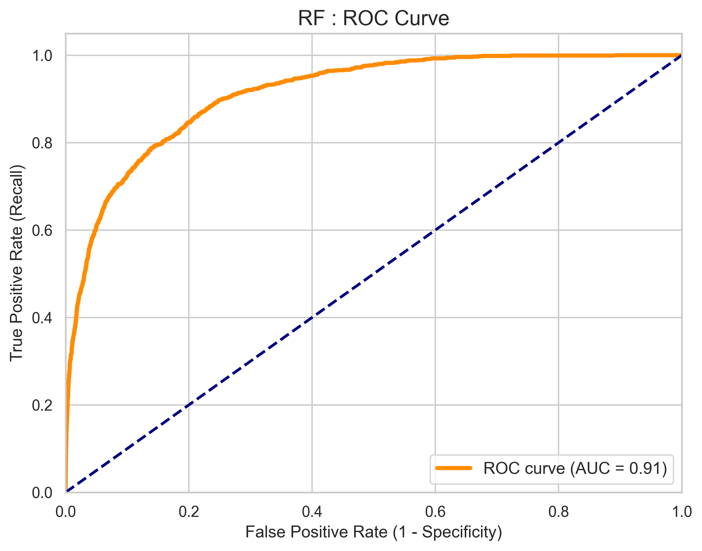
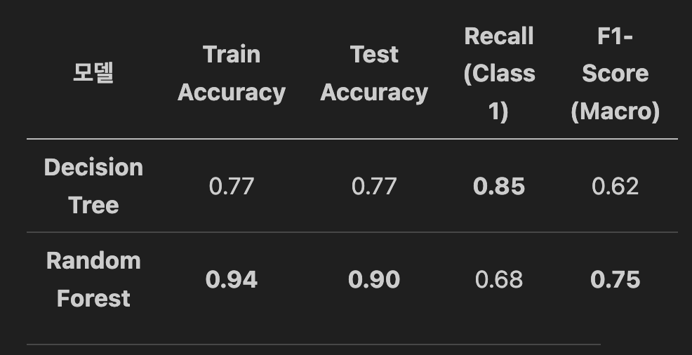

# 🏆 ML 미니 프로젝트 1팀

## 1. 프로젝트 주제 및 배경
- **주제**: (여기에 주제를 적어주세요)
- **주제 선정 배경**: (비용 절감, 문제 해결 등 선정 이유를 적어주세요)

## 2. 데이터셋 개요 및 전처리
- **데이터셋 정보**: (데이터 출처, 행/열 개수 등)
### 💧 파생변수 생성: 실효습도 (Effective Humidity)

산불 예측의 정확도를 높이기 위해 당일의 습도뿐만 아니라 과거의 습도가 누적되어 지표면의 건조 상태에 영향을 미치는 **'실효습도'**를 파생변수로 생성하였습니다.

#### 🧐 실효습도란?
> 화재 예방의 목적으로 사용되는 지수로, 당일의 상대습도뿐만 아니라 **전날부터 과거 수일간의 습도에 경과시간에 따른 가중치를 주어 산출한 지수**입니다. 목재 등의 건조도를 나타내며 산불 발생 위험도를 판단하는 중요한 지표가 됩니다.

#### 📐 계산 공식
실효습도($H_e$)는 다음과 같은 수식으로 계산됩니다.
$$H_e = (1 - r)(h_0 + r^1h_1 + r^2h_2 + r^3h_3 + r^4h_4 + r^5h_5)$$
* $r$: 연소율 (일반적으로 0.7 사용)
* $h_n$: n일 전의 평균 상대습도

---

### 🖼️ 분석 시각화 및 코드

#### [산불 확산 영향 요인]

*주요 요인: 기온, 풍속, 습도 및 지형적 특성*

#### [실효습도 산출 공식 및 구현]

  
  

> **Note**: 신설된 관측소(세종, 북부산 등)의 경우 초기 과거 데이터 부재로 발생하는 결측치는 모델의 신뢰성을 위해 제거 후 분석을 진행하였습니다.

[출처]  
https://forestfire.nifos.go.kr/sys/kfp/knowFireForestList.do  
기상청 기상지상관측지침

- **전처리 과정**: (EDA 단계와 머신러닝 단계의 차이점을 간략히 기술)

## 3. 모델링 및 성능 평가
- **사용한 모델**: Decision Tree, Logistic Regression, XGBoost, Random Forest 등
- **성능 향상을 위한 노력**: (하이퍼파라미터 튜닝, 특성 공학 등)
- **최종 모델 및 성능 결과**: (정확도, F1-score 등)

### Desicion Tree & RandomForest
[하이퍼 파라미터]

모델 성능 극대화를 위해 Optuna를 활용하여 하이퍼파라미터 튜닝을 수행하였습니다. 그 결과 Decision Tree는 과적합 방지를 위해 최대 깊이를 5로 제한하였으며, Random Forest는 265개의 결정 트리와 'log2' 특성 선택 방식을 통해 예측 안정성을 확보한 최적의 파라미터 조합을 도출했습니다

[모델 정확도 스코어]
                Train / Test
Desicion Tree : 0.77  / 0.77
Random Forest : 0.94  / 0.90

[Classification Report]

모델,Accuracy,Recall (Class 1),F1-Score (Macro)
Decision Tree,0.77,0.85,0.62
Random Forest,0.91,0.68,0.75

"Decision Tree는 **85%의 높은 재현율(Recall)**로 산불 발생 징후를 민감하게 포착하지만, 낮은 정밀도로 인해 오탐지가 발생하는 한계가 있었습니다. 이를 개선한 Random Forest는 정밀도를 46%까지 끌어올리고 전체 정확도를 91%로 향상시켜, 모델의 안정성과 예측 신뢰도를 동시에 확보한 최적의 성능을 보여주었습니다."

[특성 중요도]  
두 모델이 산불 예측을 위해 어떤 변수를 중요하게 판단했는지(Feature Importance) 비교 분석한 내용입니다. 이 시각화 자료는 모델의 판단 근거를 보여주는 아주 중요한 지표입니다.

두 모델 모두 **'실효습도'**를 산불 발생의 가장 결정적인 요인으로 판단했습니다. Decision Tree는 실효습도와 토지 피복도(논 비율) 등 상위 몇 개 변수에 의존도가 높은 반면, Random Forest는 실효습도 외에도 상대습도, 기온, 풍속 등 기상 변수들을 더욱 고르게 반영하여 예측의 다각화를 이루었습니다. 결과적으로 Random Forest가 기상 데이터의 복합적인 상호작용을 더 잘 학습하여 안정적인 예측 성능을 낼 수 있었습니다

[ROC/AUC]  
마지막으로 모델의 분류 성능을 종합적으로 나타내는 ROC Curve와 AUC 수치를 비교한 분석 내용입니다. 이 그래프는 모델이 얼마나 안정적으로 '산불 발생'과 '미발생'을 구분해내는지를 보여줍니다.

"모델의 이진 분류 성능을 평가하는 ROC Curve 분석 결과, **Random Forest(AUC = 0.91)**가 **Decision Tree(AUC = 0.89)**보다 높은 수치를 기록하며 전반적인 예측 판별력이 더 우수함을 입증했습니다. 두 모델 모두 좌상단으로 치우친 이상적인 곡선 형태를 보이고 있어 산불 예측 모델로서의 유효성을 충분히 확보하였으나, Random Forest가 곡선 아래 면적(AUC)에서 0.02 가량 앞서며 미세한 성능 우위를 점했습니다."

### 🌲 Decision Tree & Random Forest 비교 분석

#### [하이퍼 파라미터 튜닝 결과]
<table style="width: 100%; border-collapse: collapse;">
  <tr>
    <td style="width: 50%; text-align: center; vertical-align: top;">
      
      
<b>Decision Tree 파라미터</b>

    </td>
    <td style="width: 50%; text-align: center; vertical-align: top;">
      
      
<b>Random Forest 파라미터</b>

    </td>
  </tr>
</table>

모델 성능 극대화를 위해 **Optuna**를 활용하여 하이퍼파라미터 튜닝을 수행하였습니다.
* **Decision Tree**: 과적합 방지를 위해 **최대 깊이(max_depth)를 5**로 제한하였습니다.
* **Random Forest**: **265개의 결정 트리**와 **'log2' 특성 선택 방식**을 통해 예측 안정성을 확보한 최적의 조합을 도출했습니다.

---

#### [두 모델 성능 비교]

---

#### [Classification Report]
<table style="width: 100%;">
  <tr>
    <td style="width: 50%; text-align: center;">
      
    </td>
    <td style="width: 50%; text-align: center;">
      
    </td>
  </tr>
</table>

> **Decision Tree**는 **85%의 높은 재현율(Recall)**로 산불 발생 징후를 민감하게 포착하지만, 낮은 정밀도로 인해 오탐지가 발생하는 한계가 있었습니다. 이를 개선한 **Random Forest**는 **정밀도를 46%까지** 끌어올리고 **전체 정확도를 91%로 향상**시켜, 모델의 안정성과 예측 신뢰도를 동시에 확보했습니다.

---

#### [특성 중요도 (Feature Importance)]
<table style="width: 100%;">
  <tr>
    <td style="width: 50%; text-align: center;">
      
    </td>
    <td style="width: 50%; text-align: center;">
      
    </td>
  </tr>
</table>

두 모델 모두 '**실효습도**'를 산불 발생의 가장 결정적인 요인으로 판단했습니다.
* **Decision Tree**: 실효습도와 토지 피복도(논 비율) 등 **특정 상위 변수**에 의존도가 높습니다.
* **Random Forest**: 실효습도 외에도 상대습도, 기온, 풍속 등 **기상 변수들을 고르게 반영**하여 예측의 다각화를 이루었으며, 기상 데이터의 복합적인 상호작용을 더 잘 학습했습니다.

---

#### [ROC Curve & AUC]
<table style="width: 100%;">
  <tr>
    <td style="width: 50%; text-align: center;">
      
      
<b>AUC = 0.89</b>

    </td>
    <td style="width: 50%; text-align: center;">
      
      
<b>AUC = 0.91</b>

    </td>
  </tr>
</table>

ROC Curve 분석 결과, **Random Forest(AUC = 0.91)**가 Decision Tree보다 높은 수치를 기록하며 전반적인 예측 판별력이 우수함을 입증했습니다. 두 모델 모두 좌상단으로 치우친 **이상적인 곡선 형태**를 보여 유효성을 확보하였으나, **Random Forest가 AUC에서 0.02 가량 앞서며** 미세한 성능 우위를 점했습니다.

## 4. 실제 예측 결과 및 기대 효과
- **예측 결과**: (최종 선택 모델의 예측 결과 요약)
- **기대 효과**: (머신러닝 도입에 따른 기회비용 절감 및 기대 효과)

---
### 📂 폴더 구조 안내
- **data/**: 데이터셋 파일 (raw, processed)
- **notebooks/**: EDA 및 실험용 주피터 노트북
- **src/**: 실제 실행용 파이썬 코드
- **models/**: 학습된 모델 저장 (.pkl, .h5 등)
