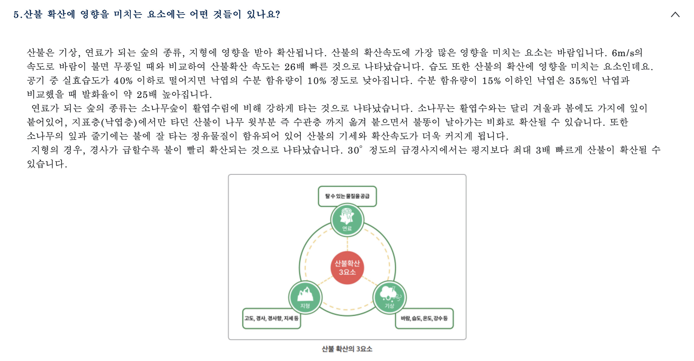

# 🏆 ML 미니 프로젝트 1팀

## 1. 프로젝트 주제 및 배경
- **주제**: (여기에 주제를 적어주세요)
- **주제 선정 배경**: (비용 절감, 문제 해결 등 선정 이유를 적어주세요)

## 2. 데이터셋 개요 및 전처리
- **데이터셋 정보**: (데이터 출처, 행/열 개수 등)
### 💧 파생변수 생성: 실효습도 (Effective Humidity)

산불 예측의 정확도를 높이기 위해 당일의 습도뿐만 아니라 과거의 습도가 누적되어 지표면의 건조 상태에 영향을 미치는 **'실효습도'**를 파생변수로 생성하였습니다.

#### 🧐 실효습도란?
> 화재 예방의 목적으로 사용되는 지수로, 당일의 상대습도뿐만 아니라 **전날부터 과거 수일간의 습도에 경과시간에 따른 가중치를 주어 산출한 지수**입니다. 목재 등의 건조도를 나타내며 산불 발생 위험도를 판단하는 중요한 지표가 됩니다.

#### 📐 계산 공식
실효습도($H_e$)는 다음과 같은 수식으로 계산됩니다.
$$H_e = (1 - r)(h_0 + r^1h_1 + r^2h_2 + r^3h_3 + r^4h_4 + r^5h_5)$$
* $r$: 연소율 (일반적으로 0.7 사용)
* $h_n$: n일 전의 평균 상대습도

---

### 🖼️ 분석 시각화 및 코드

#### [산불 확산 영향 요인]

*주요 요인: 기온, 풍속, 습도 및 지형적 특성*

#### [실효습도 산출 공식 및 구현]

  
  

> **Note**: 신설된 관측소(세종, 북부산 등)의 경우 초기 과거 데이터 부재로 발생하는 결측치는 모델의 신뢰성을 위해 제거 후 분석을 진행하였습니다.

[출처]  
https://forestfire.nifos.go.kr/sys/kfp/knowFireForestList.do  
기상청 기상지상관측지침

- **전처리 과정**: (EDA 단계와 머신러닝 단계의 차이점을 간략히 기술)

## 3. 모델링 및 성능 평가
- **사용한 모델**: Decision Tree, Logistic Regression, XGBoost 등
- **성능 향상을 위한 노력**: (하이퍼파라미터 튜닝, 특성 공학 등)
- **최종 모델 및 성능 결과**: (정확도, F1-score 등)

## 4. 실제 예측 결과 및 기대 효과
- **예측 결과**: (최종 선택 모델의 예측 결과 요약)
- **기대 효과**: (머신러닝 도입에 따른 기회비용 절감 및 기대 효과)

---
### 📂 폴더 구조 안내
- **data/**: 데이터셋 파일 (raw, processed)
- **notebooks/**: EDA 및 실험용 주피터 노트북
- **src/**: 실제 실행용 파이썬 코드
- **models/**: 학습된 모델 저장 (.pkl, .h5 등)
